# Themify Architecture

This diagram shows how the different modules in the Themify CLI tool are connected.

```mermaid
graph TD
    %% Files
    index["index.ts<br/>(Exports Module)"]
    cli["cli.ts<br/>(Entry Point)"]
    types["types.ts<br/>(Type Definitions)"]
    file["utils/file.ts<br/>(File Operations)"]
    colorExtractor["extractors/colorExtractor.ts<br/>(Color Extraction)"]
    themeGenerator["generators/themeGenerator.ts<br/>(Theme Generation)"]

    %% Connections - Imports
    cli -->|imports| file
    cli -->|imports| colorExtractor
    cli -->|imports| themeGenerator
    
    colorExtractor -->|imports| types
    themeGenerator -->|imports| types
    
    %% Connections - Exports
    index -->|exports| file
    index -->|exports| colorExtractor
    index -->|exports| themeGenerator
    index -->|exports| types

    %% Function flow
    subgraph "Main Flow"
        direction LR
        findImages["findImagesInPublicFolder()"] --> selectImage["User selects image"]
        selectImage --> findCSS["findGlobalsCssPath()"]
        findCSS --> extractColors["extractColorsFromImage()"]
        extractColors --> generateVars["generateCSSVariables()"]
        generateVars --> updateCSS["updateGlobalsCss()"]
    end

    %% File content descriptions
    subgraph "File Descriptions"
        direction TB
        fileDesc["file.ts:<br/>- findImagesInPublicFolder()<br/>- findGlobalsCssPath()<br/>- updateGlobalsCss()"]
        extractorDesc["colorExtractor.ts:<br/>- extractColorsFromImage()<br/>- extractFromSvg()<br/>- extractFromRaster()"]
        generatorDesc["themeGenerator.ts:<br/>- generateCSSVariables()<br/>- getLuminance()<br/>- findContrastColor()"]
        typesDesc["types.ts:<br/>- Color interface"]
        cliDesc["cli.ts:<br/>- main()<br/>- CLI interface"]
        indexDesc["index.ts:<br/>- Re-exports all modules"]
    end

    %% Style
    classDef module fill:#f9f,stroke:#333,stroke-width:2px;
    classDef flow fill:#bbf,stroke:#333,stroke-width:1px;
    classDef desc fill:#dfd,stroke:#333,stroke-width:1px;
    
    class index,cli,types,file,colorExtractor,themeGenerator module;
    class findImages,selectImage,findCSS,extractColors,generateVars,updateCSS flow;
    class fileDesc,extractorDesc,generatorDesc,typesDesc,cliDesc,indexDesc desc;
```

## Module Responsibilities

### index.ts
- Acts as a central export point for all modules
- Makes it easy to import functionality from a single location

### cli.ts
- Entry point for the CLI application
- Orchestrates the overall flow of the application
- Handles user interaction and command-line interface

### types.ts
- Contains shared type definitions
- Defines the Color interface used across multiple modules

### utils/file.ts
- Handles file system operations
- Finds images in the project's public folder
- Locates and updates the globals.css file

### extractors/colorExtractor.ts
- Extracts colors from different image formats
- Handles SVG and raster images differently
- Uses extract-colors and get-pixels libraries

### generators/themeGenerator.ts
- Generates CSS variables from extracted colors
- Applies design principles for color selection
- Ensures proper contrast between foreground and background colors
